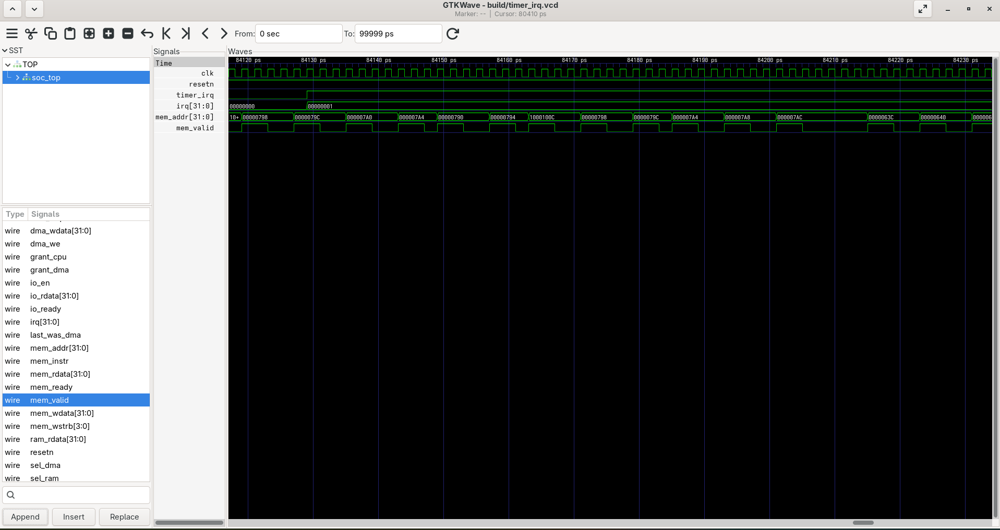
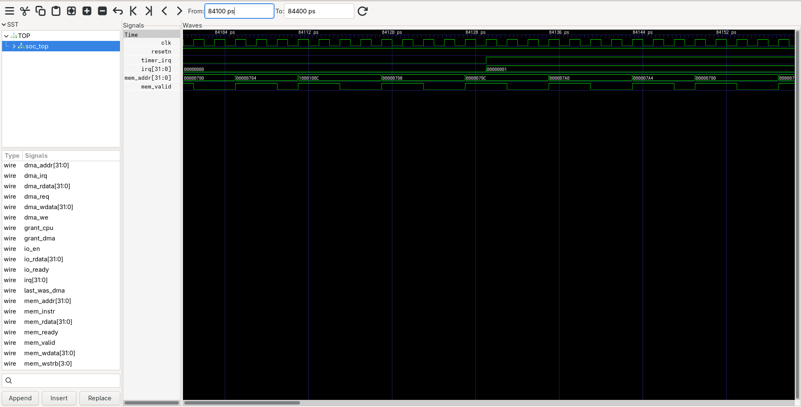

xplat

A cross-platform test framework for a small RV32I SoC. Write each hardware test once in Python and run it unchanged on a Python reference model, on the Verilator RTL simulation, and on a real FPGA over UART. The runner compares the results across backends and flags any test that passes on one and fails on another.

The SoC under test (PicoRV32, UART, timer, DMA, firmware, Verilator testbench) comes from the mini-soc-bringup repo. The RTL, firmware and testbench here are that code. This repo adds the register spec, the generators, the three backends, the tests and the regression runner on top of it, and the few small changes the framework needed are listed under "What Changed In The SoC".

What It Does

Takes one register spec, generates everything that depends on it, and checks that the model, the RTL and the hardware all agree with it.

    spec/registers.yaml            one file: bases, offsets, fields, access, resets
         |
         |  tools/gen_regs.py
         v
    gen/regs.h  gen/regs.py  gen/regs_pkg.sv  docs/registers.md
         |            |
      firmware     xplat/hal  Backend API: read_reg write_reg dma_copy wait_irq reset
      drivers           |
            +-----------+-----------------------+
            |                                   |
            |                   +---------------+---------------+
            |                   |               |               |
            |             ModelBackend     RtlBackend     FpgaBackend
            |             Python model     Verilator +    pyserial, or
            |             of the spec      UART monitor   FakeSerial in tests
            |                   |               |               |
            |                   +---------------+---------------+
            |                                   |
            |                        xplat/tests, 7 tests
            |                      written against Backend only
            |                                   |
            |                     xplat/run_regression.py
            |                        runs, then compares
            |                                   |
            +-------------------------> console table, JUnit XML, HTML report

Why It Exists

A model that disagrees with the RTL is the cheapest bug detector there is, but only if both are driven by the same tests. Here the tests contain no backend-specific code (a unit test greps for it), so a difference in outcome is a difference in behaviour. Run on the real board, the same tests tell you whether the silicon matches the simulation.

Building

    make CROSS=riscv64-elf- xplat

That checks the generated files are current, runs the pytest suite, and runs the regression on all three backends. Drop CROSS= on Ubuntu, where the Makefile finds riscv64-unknown-elf- by itself.

Needs verilator, a RISC-V bare-metal gcc, make, python3 and three Python packages.

Install on Arch Linux:

    sudo pacman -S --needed base-devel verilator python python-yaml python-pytest python-pyserial riscv64-elf-gcc riscv64-elf-binutils

Install on Ubuntu 24.04:

    sudo apt install verilator gcc-riscv64-unknown-elf binutils-riscv64-unknown-elf make python3 g++ python3-yaml python3-pytest python3-serial

PyYAML is only used by the generator, pyserial only for a real FPGA. The tests, model, runner and reports need neither. Check the compiler can target rv32i before building (the path must end in rv32i/ilp32/libgcc.a):

    riscv64-elf-gcc -march=rv32i -mabi=ilp32 -print-libgcc-file-name

Usage

    make CROSS=riscv64-elf- xplat            everything below, in order
    make check-gen                           fail if gen/ or docs/registers.md are stale
    make gen                                 regenerate them from spec/registers.yaml
    make xplat-unit                          pytest unit tests
    make CROSS=riscv64-elf- xplat-regress    regression on model, rtl, fpga-fake
    make CROSS=riscv64-elf- xplat-bugdemo    plant each bug in the RTL, check it is caught
    make CROSS=riscv64-elf- all-tests        the original SoC firmware tests

Reports go to reports/junit.xml and reports/report.html.

Running the runner directly:

    python3 xplat/run_regression.py --backends model,rtl
    python3 xplat/run_regression.py --backend rtl --tests dma_copy_edge,random_dma
    python3 xplat/run_regression.py --list

| Flag | Meaning |
|---|---|
| --backends A,B | any of model, rtl, fpga. The first is the reference in the mismatch report |
| --backend A | one backend |
| --tests a,b | only these tests |
| --seed N | seed for random_dma, default 0x5eed1234. Same seed, same transfers |
| --serial PORT | serial port for fpga, or fake (default) |
| --baud N | serial baud, default 115200 |
| --reset-command CMD | shell command that resets the board between tests |
| --sim PATH, --firmware PATH | simulator and monitor image for rtl |
| --junit FILE, --html FILE | write the reports |
| --inject-bug NAME | plant a deliberate bug, see docs/bug_demo.md |
| --bug-target rtl or model | where the bug goes, default rtl |
| --quiet | table and verdict only |

Exit code is 0 when every test passes everywhere and no backends disagree, 1 on any failure, error or mismatch, 2 on a usage error.

Backends

| Backend | What it is | Reset |
|---|---|---|
| model | functional Python model generated from the spec, with W1C, RO, WO and reset behaviour, a counting timer and a DMA engine | fresh state |
| rtl | the Verilator simulation, driven through the UART monitor over a TCP socket (reuses tools/regtool.py) | restarts the simulator, a true reset |
| fpga | the same R/W line protocol over pyserial | your reset command, else a soft reset that rewrites reset values |
| fpga-fake | FpgaBackend talking to FakeSerial, which runs the model behind a fake serial port | power cycle of the fake |

Tests

| Test | What it checks |
|---|---|
| reg_reset_values | every register reads its spec reset value after a reset that follows dirty writes |
| reg_access_types | RW reads back, RO ignores writes, W1C clears only on 1, WO reads zero |
| timer_basic | match fires within a tolerance of the compare value, reload wraps the counter |
| dma_copy_basic | 32 words copied, source and guard words untouched, config registers unchanged |
| dma_copy_edge | zero length, SRC DST LEN writes ignored while busy, start while busy, scratch region boundaries |
| dma_done_flag | done sets, is sticky, clears only on write 1, drives the dma irq |
| random_dma | 12 constrained-random transfers, some overlapping, checked word by word against a reference copy |

The register spec

spec/registers.yaml is the only place a register is defined. Each field has bit range, access type and description, each register an offset and reset value:

    TIMER:
      base: 0x10001000
      registers:
        - name: STATUS
          offset: 0xc
          reset: 0x0
          fields:
            - name: MATCH
              bits: "0"
              access: W1C
              trigger: [[TIMER.COMPARE, 0], [TIMER.COUNT, 0], [TIMER.CTRL, 1]]
              cleanup: [[TIMER.CTRL, 0]]

Access types are RW, RO, WO, W1C and SPECIAL (side effects on read or write, skipped by the generic register tests: UART DATA and SYS EXIT). The trigger lines tell the generic W1C test how to raise that flag. The generator checks the spec (overlapping fields, duplicate offsets, bad bit ranges, resets outside fields, unknown access types) before it writes anything.

From it tools/gen_regs.py writes gen/regs.h (offsets, masks, shifts, resets), gen/regs.py (what the model and tests use), gen/regs_pkg.sv (a SystemVerilog package, lints clean under Verilator) and docs/registers.md. The firmware drivers include gen/regs.h and carry compile-time checks that every driver struct field sits at the spec offset. A unit test also cross-checks the spec against rtl/uart.v, rtl/timer.v and sim/tb.cpp, so a reset value cannot drift unnoticed.

Interrupts

The monitor has no way to report an interrupt. The framework does not need one. Every irq line in this SoC is a status flag AND an enable bit, so wait_irq reads those two fields and reports the line as high when both are set:

    irq timer = TIMER.STATUS.MATCH and TIMER.CTRL.IRQ_EN
    irq dma   = DMA.STATUS.DONE    and DMA.CTRL.IRQ_EN

The sources are listed under irqs: in the spec, so a new interrupt is one more line there. This works the same on all three backends. It checks the level the peripheral drives, not that the CPU takes it. Taking the interrupt is covered by the firmware tests (timer_irq, dma_memcpy). wait_irq(name, timeout, polls) returns True or False, it never raises.

Time In Each Backend

Each register access through the monitor takes thousands of simulated cycles, so the timer and the DMA move between accesses. Two things keep that reproducible.

The testbench runs in lock-step in socket mode. Simulated time advances only while UART bytes are in flight, plus a fixed idle grace period, then the testbench blocks on the socket. Between two accesses the cycle count depends only on the commands, not on how fast Python is. Measured on this machine, five timer reads in a row differ by exactly 9292 cycles every time.

The tests do not hard-code those numbers. timer_basic first measures how many timer counts one register read costs, then picks the compare value and the tolerance from that. The model uses 9000 cycles per access and 6 cycles per DMA word, close to what the RTL measures, which only matters for the busy window: a self-copy of the whole 24 KB scratch area keeps the DMA busy for about three status reads on the RTL (measured) and four on the model, which dma_copy_edge needs to prove a write happened while busy.

Adding A Test

Drop a file in xplat/tests/, register it, add it to ORDER in xplat/tests/__init__.py. A test is a function of the backend and a logger:

    from xplat.framework import expect_eq, register
    from xplat.hal.base import Backend

    @register("uart_baud", "baud divisor reads back its reset value")
    def uart_baud(b: Backend, log) -> None:
        expect_eq("UART.BAUD", b.read("UART.BAUD"), 0x10, b.addr("UART.BAUD"))

Use register names from the spec (b.read("DMA.STATUS"), b.read_field("DMA.STATUS.DONE")), plain addresses for RAM (b.read_reg, b.write_words), b.dma_copy and b.wait_irq. Raise TestFailure through expect_eq, expect_true or expect_words: they carry the register or data location that ends up in the mismatch report. Use the scratch area from xplat/tests/common.py for RAM. Do not mention a backend by name, the unit tests fail if you do. A test that cannot run on some backend raises Skip, which is not counted as a mismatch.

Adding A Backend

Subclass Backend in xplat/hal/, implement read_reg, write_reg and reset (and close if there is something to release), and add one branch to create_backend in xplat/hal/registry.py plus the name in BACKENDS. dma_copy, wait_irq, read_field, read_words and write_words come from the base class. Raise BackendTimeout when the target does not answer and BackendProtocolError when it answers nonsense, the runner reports both as ERROR with the message.

Running On An FPGA

FpgaBackend speaks the same protocol as the simulator: R addr, W addr val, P, one line each way, hex, word aligned. The board needs the SoC with the UART on a serial port and fw/apps/monitor.c as the firmware.

    python3 xplat/run_regression.py --backends model,fpga --serial /dev/ttyUSB0 --baud 115200

Things to set up first:

- The UART divisor. rtl/uart.v defaults to 16 clocks per bit, which is for simulation. Set DEFAULT_BAUD to your clock divided by the baud rate, change reset and test_values for UART.BAUD in the spec, run make gen, and rebuild the monitor. The tests compare against the spec, so they follow.
- Reset. A serial link cannot reset the SoC. Pass --reset-command with whatever resets your board (a GPIO script, openFPGALoader --reset). Without it reset() is a soft reset: it waits for the DMA, then writes every register's reset value back. That cleans the registers but does not prove they reset, so run reg_reset_values right after power-up, or give a real reset command.
- RAM is not cleared by a reset on hardware. The tests only read RAM they wrote, so this is fine.
- Timing differs. On hardware the counter runs at the real clock, and timer_basic calibrates to whatever one serial command costs. dma_copy_edge needs the DMA to stay busy across two register accesses. At 115200 baud one command takes about a millisecond, and a fast DMA may copy the 6144-word scratch area in less than that. If so the test fails with "transfer ended before the check could prove the write happened while busy". That message means the test cannot prove the property at that speed, it is not a DMA bug. This has not been tried on hardware, it is what the numbers suggest.

The FPGA backend has been tested against FakeSerial only, which speaks the monitor protocol over the model and can drop, corrupt and truncate replies. It has not been run on hardware. FakeSerial is also available from the CLI as --serial fake, the default, which is the fpga-fake column.

Sample Output

    $ make CROSS=riscv64-elf- xplat-regress
    TEST              model        rtl          fpga-fake    VERDICT
    ----------------------------------------------------------------
    reg_reset_values  PASS 0.00s   PASS 0.16s   PASS 0.00s   ok
    reg_access_types  PASS 0.00s   PASS 0.48s   PASS 0.00s   ok
    timer_basic       PASS 0.00s   PASS 0.19s   PASS 0.00s   ok
    dma_copy_basic    PASS 0.00s   PASS 0.34s   PASS 0.00s   ok
    dma_copy_edge     PASS 0.01s   PASS 0.57s   PASS 0.01s   ok
    dma_done_flag     PASS 0.00s   PASS 0.17s   PASS 0.00s   ok
    random_dma        PASS 0.00s   PASS 1.67s   PASS 0.00s   ok

    21 results: 21 pass, 0 fail, 0 error, 0 skip, 0 mismatch

    junit: reports/junit.xml
    html:  reports/report.html

    REGRESSION PASSED

With the DMA length bug planted in the RTL (python3 xplat/run_regression.py --backends model,rtl --inject-bug dma_len_off_by_one):

    dma_copy_basic    PASS 0.00s   FAIL 0.45s   MISMATCH
    dma_copy_edge     PASS 0.01s   FAIL 0.33s   MISMATCH
    random_dma        PASS 0.00s   FAIL 0.27s   MISMATCH

    MISMATCH dma_copy_basic
        agree:    model
        disagree: rtl
            where:    guard word after dst
            expected: 0xa5a5a5a5
            actual:   0xdeadbeef

The walk-through of what that output says is in docs/bug_demo.md.

Reports

The HTML report has the test by backend grid colored by result, the runtime per cell, the mismatch section and every failure log. The JUnit XML has one test suite per backend plus a suite called xplat.cross-backend where each mismatch is a failing test case, so a CI system flags a disagreement even when each backend looks fine on its own.

What Changed In The SoC

The framework needed three small changes to the SoC code. Everything else under rtl/, fw/ and sim/ is untouched.

- Firmware drivers use gen/regs.h for bases, masks and offsets instead of hand-written constants. The firmware compiles to the same code, the original tests give the same cycle counts as before.
- sim/tb.cpp, socket mode only: simulated time is lock-step (see Time In Each Backend) and TCP_NODELAY is set. Before this, simulated time ran against the wall clock, the cycle count between two register reads varied from 116,000 to 190,000 depending on how fast Python was, and a DMA transfer always finished before the next status read. Normal runs without --listen are not affected.
- rtl/dma.v and rtl/timer.v each have one `ifdef for the bug demo. With no define set the RTL is identical.

Problems Hit Building It

- The DMA busy window was invisible. Through the monitor, a DMA copy always finished before the next status read, so "config writes ignored while busy" could not be tested on the RTL. Cause: the testbench free-ran between commands, and Nagle plus delayed ACK on the one-byte-at-a-time reply added about 40 ms per command, roughly 190,000 cycles. Fixed with the lock-step socket mode. A command went from about 40 ms to about 2 ms.
- The busy test had to be built around what is observable. A write can only be shown to have happened while busy if a later status read still shows busy. dma_copy_edge copies the 24 KB scratch area onto itself (harmless, same data), writes the register, then reads status, in that order.
- random_dma took 49 seconds on the RTL. The first version checked the whole address range between a random source and a random destination, thousands of words. It now checks two small windows.
- The first FPGA sync left a stale OK in the buffer. The monitor prints READY at boot and the retry loop sent a second ping. It now sends one ping and reads lines until OK.
- A bug planted in the model reaches the fake FPGA too, because the fake runs the model. Compare against the RTL.

Limitations

- The FPGA backend has not been run on hardware, see above.
- The model is functional with approximate timing. It matches the RTL on behaviour and roughly on the busy window, not cycle by cycle.
- Interrupt delivery to the CPU is not covered by the Python tests, only the irq level (see Interrupts). The firmware tests cover delivery.
- UART DATA, UART TX and RX, and SYS EXIT are not exercised: the monitor uses the UART itself, and writing SYS EXIT ends the simulation.
- The tests use a 24 KB scratch area (0x9000 to 0xF000) that the monitor does not touch. Anything else in RAM belongs to the monitor.
- Each RTL test restarts the simulator, so the RTL column costs about 3.5 s in total in the sample run.

Layout

    spec/registers.yaml          the register spec
    tools/gen_regs.py            generator and --check
    gen/                         regs.h, regs.py, regs_pkg.sv (generated, committed)
    xplat/hal/                   Backend, ModelBackend, RtlBackend, FpgaBackend, FakeSerial, registry
    xplat/tests/                 the seven tests
    xplat/framework.py           test registry, TestFailure, expect helpers
    xplat/runner.py              run, compare backends, verdicts
    xplat/report.py              console table, JUnit XML, HTML
    xplat/run_regression.py      command line
    xplat/unit/                  pytest tests for all of the above
    docs/registers.md            generated register reference
    docs/bug_demo.md             the bug demo walkthrough
    rtl/ fw/ sim/ tools/regtool.py   the SoC, from mini-soc-bringup

The SoC Under Test

The rest of this file describes the SoC from mini-soc-bringup, which is what all three backends model.

A small RV32I SoC built around PicoRV32, with a UART, a timer and a DMA engine, plus bare-metal C firmware and a Verilator testbench. Boots firmware in simulation, takes interrupts, copies memory with DMA, and reports pass/fail through a magic exit register. The whole RTL (excluding PicoRV32) is about 470 lines.

Architecture

    +-----------+  mem_valid/mem_ready   +-----------------------------+
    | PicoRV32  |<---------------------->|  address decoder (soc_top)  |
    | ENABLE_IRQ|                        +--+-------+-------+-------+--+
    +-----^-----+                           |       |       |       |
          | irq[1:0]                        |       |       |       |
          |                              +--v--+ +--v--+ +--v--+ +--v--+
          |                              | RAM | |UART | |TIMER| | DMA |
          |                              |64 KB| |     | |     | |     |
          |                              +--^--+ +-----+ +--+--+ +-+-+-+
          |                                 |               |      | |
          |                          arbiter (CPU / DMA)    |      | |
          |                                 +---------------+------+ |
          +----------- timer irq (bit 0), dma irq (bit 1) -----------+

The DMA is a second bus master on the RAM. A small arbiter in soc_top alternates between the CPU and the DMA when both want the RAM, so neither starves. See docs/dma.md.

Memory Map

| Range | Device |
|---|---|
| 0x0000_0000 - 0x0000_FFFF | RAM, 64 KB |
| 0x1000_0000 | UART |
| 0x1000_1000 | TIMER |
| 0x1000_2000 | DMA |
| 0x1000_3000 | SYS, write the exit code here to end the simulation |

The register-level detail is generated from the spec into docs/registers.md. Firmware splits the 64 KB in the linker script: code, rodata and the .data load image in the low 32 KB, .data, .bss and the stack in the high 32 KB.

Boot Flow

    reset, PC = 0x0000_0000
      -> vectors: "j reset_handler" at 0x00, irq_entry at 0x10
      -> reset_handler (start.S)
           sp = _stack_top
           zero .bss
           copy .data from its load address in the low half
           call main
      -> main returns a status
      -> start.S writes it to the SYS exit register
      -> testbench stops and returns that status as the process exit code

PicoRV32 comes out of reset with every interrupt masked, so firmware unmasks the ones it wants with the maskirq instruction. The details of start.S are in docs/boot_and_irq.md.

Interrupt Handling

    peripheral raises its level irq (timer match, dma done)
      -> PicoRV32 finishes the current instruction, saves the return PC in q0 and the pending mask in q1
      -> jumps to 0x10 (irq_entry)
      -> irq_entry saves x1..x31 and the return PC to irq_regs
      -> a0 = pending mask, calls irq_handler(pending) in C
      -> timer_isr / dma_isr read their status, write 1 to clear the flag, bump a counter
      -> irq_entry restores registers, retirq jumps back to q0

Each peripheral irq is a level signal that stays high until the status flag is cleared, so the handler must clear it before returning. Timer is irq bit 0, DMA is irq bit 1.

Waveform: Timer Interrupt (Pending but Masked)

Captured with make sim TEST=timer_irq TRACE=1 and viewed in GTKWave.

timer_irq goes high and irq becomes 00000001 (bit 0 is the timer). The CPU does not jump to irq_entry yet, because the firmware has not unmasked the timer interrupt, so it stays pending. Meanwhile mem_addr shows the CPU looping in main and reading a timer register (0x1000100C) while it polls the status. The test fw/tests/timer_irq.c checks this on purpose ("masked cpu irq stays pending"). Only after irq_enable(IRQ_TIMER) does the CPU take it.

DMA

A word-copy engine from RAM to RAM. Software writes SRC, DST, LEN (in words), sets CTRL.start and either polls STATUS.done or waits for the interrupt. Internally it is a three-state machine (idle, read, write); one word costs four cycles when the RAM is free. Measured in this repo's test: 64 words in about 397 cycles while the CPU is also fetching code from the same RAM.

SoC Firmware Tests

    make CROSS=riscv64-elf- all-tests

| Test | What it checks |
|---|---|
| uart_hello | TX path, STATUS bits, BAUD register |
| timer_irq | count, compare, W1C status, masked irq stays pending, exactly N interrupts |
| dma_memcpy | polled copy, copy with done interrupt, zero length, writes ignored while busy, guard words, CPU progress during the copy |
| boot_check | .data initialised, .bss zeroed, .rodata, stack placement |

    $ make CROSS=riscv64-elf- all-tests
    TEST           RESULT   CYCLES  NOTE
    -------------- ------ --------  ----
    uart_hello     PASS      46711
    timer_irq      PASS     322451
    dma_memcpy     PASS     228389
    boot_check     PASS      65771
    regtool.py     PASS          -  python <-> uart monitor

    5 passed, 0 failed

The testbench fills RAM with 0xdeadbeef before loading the image, so a missing .bss clear shows up as garbage instead of passing by luck. Testbench flags (build/sim/soc_sim):

| Flag | Meaning |
|---|---|
| --trace | write a VCD |
| --vcd FILE | VCD path, default trace.vcd |
| --trace-cycles N | stop dumping after N cycles, default 50000 (a full VCD is large) |
| --timeout N | give up after N cycles and return 124, default 5000000 |
| --listen PORT | serve the UART on a TCP socket instead of stdout, lock-step |

The testbench exits with the firmware's exit code, 99 if the CPU traps, 124 on timeout.

Register Tool

tools/regtool.py talks to a monitor firmware (fw/apps/monitor.c) running on the simulated SoC. The testbench exposes the SoC UART on a TCP port and the tool speaks a line protocol over it. RtlBackend is built on its RegBridge class.

| Command | Reply |
|---|---|
| R addr | 8 hex digits |
| W addr value | OK |
| P | OK |
| Q | BYE, ends the simulation |

Addresses and values are hex, word aligned. Bad input gets ERR.

    $ python3 tools/regtool.py "R 10000008" "W 10001004 abcd" "R 10001004"
    R 0x10000008 = 0x00000010
    W 0x10001004 <- 0x0000abcd
    R 0x10001004 = 0x0000abcd

It starts the simulator itself. Use --port N to attach to one you started with --listen N, --shell for an interactive prompt, --selftest for the check that runs in make all-tests.

SoC Problems Hit During Bring-up

- Every interrupt was handled twice. PicoRV32 latches pending irqs by default (LATCHED_IRQ), but the peripherals hold their irq high until software clears them, so the latch was set again while the handler was running and the CPU re-entered it right after retirq. Fix: LATCHED_IRQ = 0xfffffffc, so bits 0 and 1 follow the line.
- The last UART character was lost. The firmware wrote the exit code while the final byte was still shifting out. sys_exit now waits for tx_busy to clear.
- boot_check failed on a correct .bss. It was scanning all of .bss, which includes the test framework's own variables. It now checks the test's own arrays.
- The DMA timing test measured UART printing, not the DMA. 64 words take a few hundred cycles, one printed line takes thousands. Timing is now captured with no printing in the window.

SoC Limitations

- Irq bit 1 is also PicoRV32's own ebreak/illegal-instruction interrupt, and the DMA owns that bit here. With IRQ_DMA masked, an illegal instruction traps and the testbench exits with code 99 (checked). With it unmasked, the event arrives as irq 1, dma_isr sees DONE clear and ignores it, and execution carries on (also checked). Firmware therefore keeps IRQ_DMA masked outside DMA code.
- UART RX has a single byte buffer and no FIFO. The testbench leaves two character times between injected bytes.
- The DMA only reaches RAM. Addresses outside 64 KB wrap onto it, there is no error flag.
- No RISC-V compliance suite and no formal checks.

License

MIT for the code in this repo. PicoRV32 is ISC licensed, see rtl/third_party/LICENSE.
